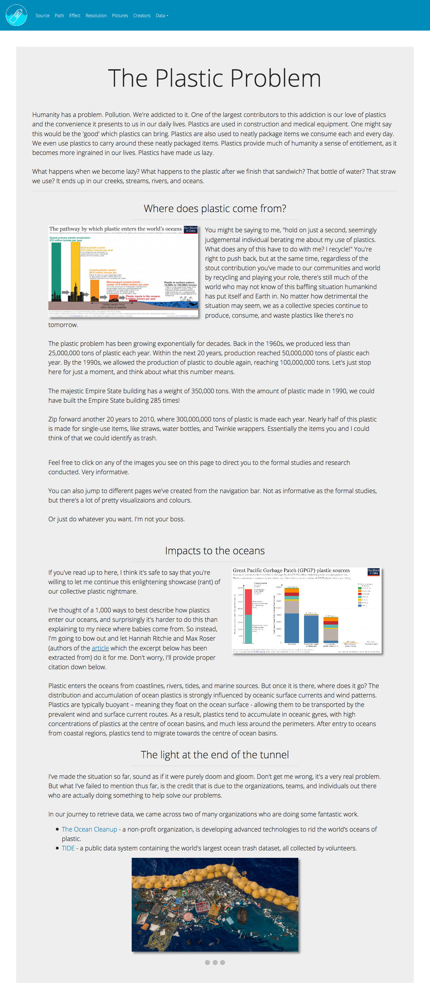
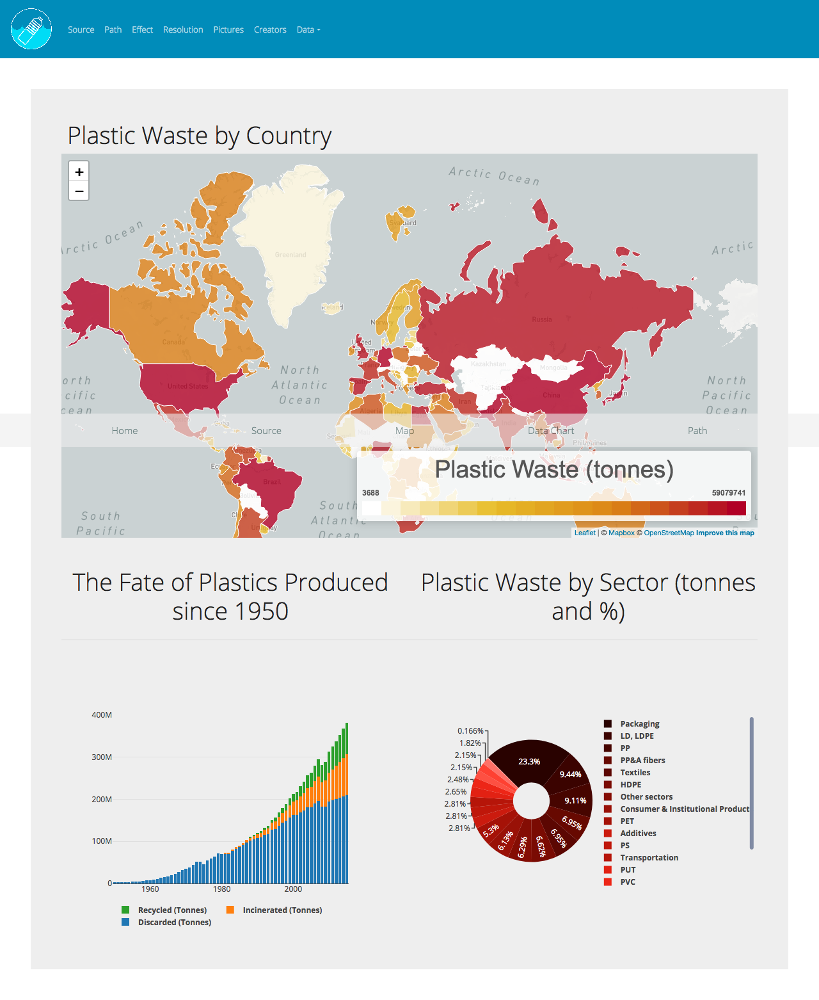
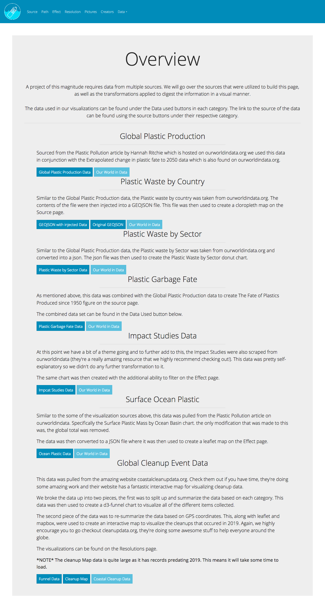

# ThePlasticProblem
Humanity has a problem. Pollution, we’re addicted to it. One of the largest contributors to this addiction is our love of plastic. Why? Because we are lazy and love convenience. It’s in everything, from packaging to construction to medical equipment. But when we’re done with it, where does this manmade material go?

This webpage aims to take the user on journey to show where the plastic comes from, how it ends up in the oceans around the world, the devastating impacts it has on our fragile enviornment, and finally the actions people are taking around the world to help recover some of that damage.

The main source used for this project is [Our World in Data](https://ourworldindata.org/plastic-pollution#all-charts-preview). For a full break down check out the sources page on the website.

To try out the webpage for yourself [click here](https://the-plastic-problem.herokuapp.com/).

Here are a few snapshots of what the webpage looks like:

