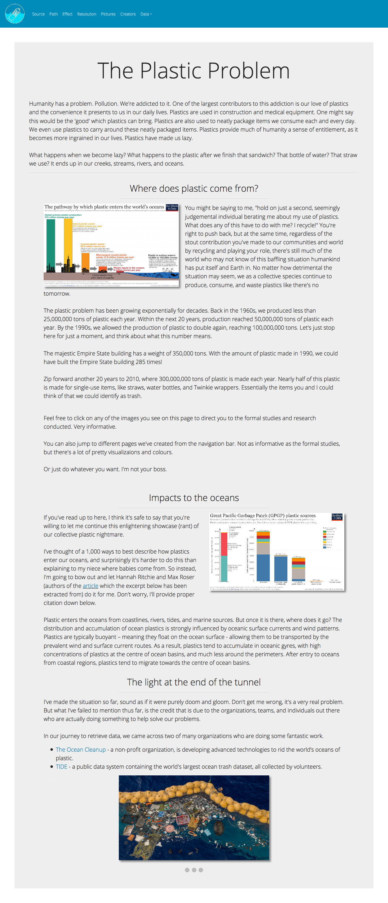
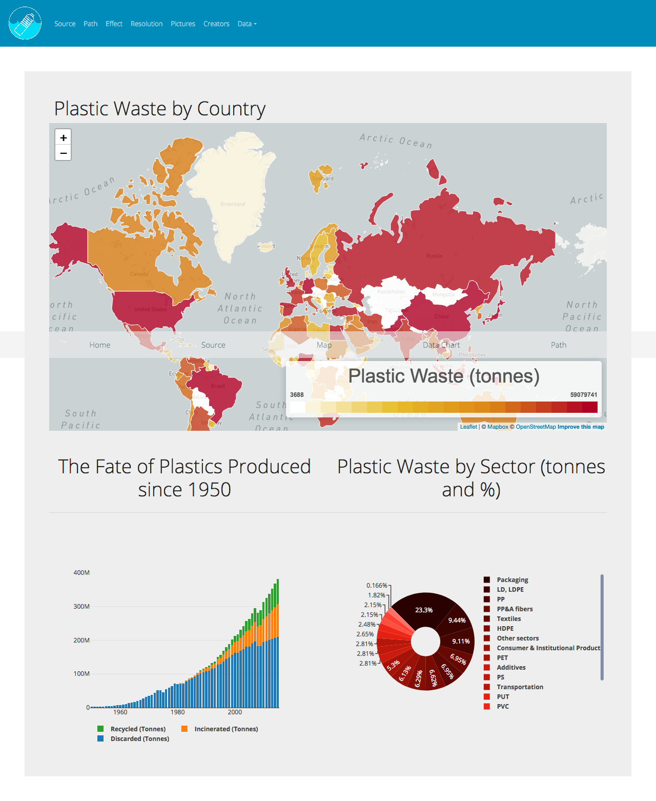
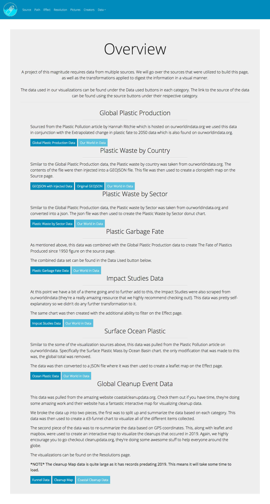

# The Plastic Problem

An interactive Flask web app that tells the story of plastic pollution from production to ocean impact and cleanup efforts.

## Mission Statement
Build a reliable, maintainable, and educational data experience that helps people understand the full plastic lifecycle (source, path, effect, resolution) and supports continuous improvement by contributors.

## Current Scope
- Flask app with page routes under `templates/`
- Data/JSON API routes in `app.py`
- Frontend visualizations in `static/js/` and `static/assets/`
- CSV/XLSX data files in `data/` and `static/data/`

## Working Branch Setup
This repo is configured for fork-based development:
- `origin`: your fork (`gustavhempel/ThePlasticProblem`)
- `upstream`: original source repo (`shozi91/ThePlasticProblem`)

Recommended flow:
1. Create a feature branch from your working branch.
2. Commit focused changes.
3. Push to `origin`.
4. Open a PR.

## Quick Start (Local)
### 1) Create environment
```bash
python -m venv .venv
.venv\Scripts\activate
pip install -r requirements.txt
```

### 2) Configure database
The app now supports `DATABASE_URL` (falls back to the existing hard-coded value if not set).

Example (PowerShell):
```powershell
$env:DATABASE_URL="postgresql://<user>:<password>@<host>:5432/<db_name>"
```

### 3) Run app
```bash
python app.py
```

Then open: `http://127.0.0.1:5000`

## Deployment
- `Procfile`: `web: gunicorn app:app --log-level info --log-file=-`
- `runtime.txt`: Python `3.7.7`

## Project Plan
See [TODO.md](TODO.md) for the prioritized backlog and execution plan.
# ThePlasticProblem
Humanity has a problem. Pollution, we’re addicted to it. One of the largest contributors to this addiction is our love of plastic. Why? Because we are lazy and love convenience. It’s in everything, from packaging to construction to medical equipment. But when we’re done with it, where does this manmade material go?

This webpage aims to take the user on journey to show where the plastic comes from, how it ends up in the oceans around the world, the devastating impacts it has on our fragile enviornment, and finally the actions people are taking around the world to help recover some of that damage.

The main source used for this project is [Our World in Data](https://ourworldindata.org/plastic-pollution#all-charts-preview). For a full break down check out the sources page on the website.

To try out the webpage for yourself [click here](https://the-plastic-problem.herokuapp.com/).

Here are a few snapshots of what the webpage looks like:



